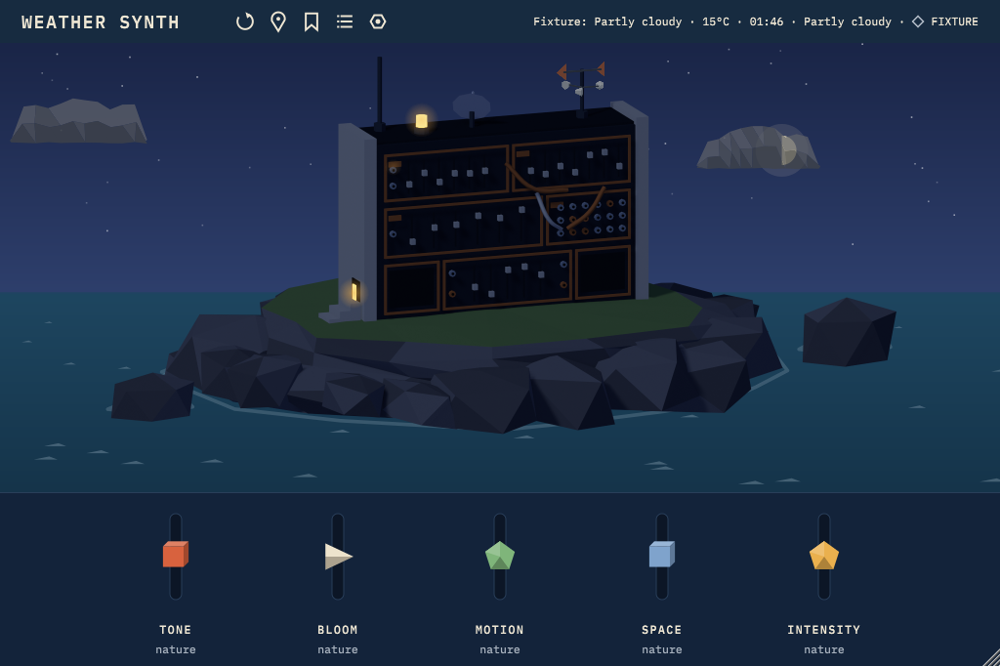

# Weather Synth GUI: handoff

Branch `claude/vibrant-wright-7kfl4a`, commits from `04e1c44` (Phase A) onwards, one commit per phase. The previous release (`latest` on GitHub) is untouched; nothing was published.



## What's there

- **Editor** (`plugin/Source/PluginEditor.*`, `plugin/Source/gui/`): 3:2, resizable 820×546 to 2048×1364, layout recomputed at every size (never a stretched bitmap). Header: ATMOSPHERIC, icon actions (refresh, place, keep Day, kept Days, display settings), and place · temperature · local time · condition · source. The scene. The five real macros.
- **Scene**: the Blender-rendered island and cabinet (eight lighting anchors blended by the sun's altitude, accents for snow/frost/ice, rotating wind vane and anemometer sprites), with a runtime sky, sun, moon, stars, clouds, sea, foam, rain/snow/sleet/hail/dust particles, fog and haze veils, lightning and a tornado funnel. All 17 environments + offline/saved: `gui-state-coverage.md`.
- **Data**: the scene shows exactly the Day the sound was dealt from (same `Day`, same observation time). The relay and `Day` gained visual-only fields (condition codes, wind direction, gust, visibility, rain/snow mm); the sound ignores them, old Days and old relay replies still load.
- **Macros**: Tone, Bloom, Motion, Space, Intensity, the real APVTS parameters (IDs, ranges, automation and saved state unchanged). Drag, shift-drag (fine), arrow keys and shift-arrows, Page Up/Down, Home or 0 (back to nature), double-click (back to nature), double-click the value to type it. Every change is a host gesture. Tooltips say what each does to the sound and that it stays inside the designed limits. The weather anchor is the notch at 0.
- **Musical feedback** (restrained, fades when silent): Tone → amber face lamp; Motion → green modulation lamp blink rate; Space → antenna halo. Bloom and Intensity have no decoration (one response per macro, at most). Fed by a lock-free activity level (one atomic store per audio block).
- **Display settings** (global, in `settings.json`, never in projects): economy 12 fps (the default) / full 24 fps / still picture; reduce motion; no lightning flashes. The system reduce-motion setting (macOS, Windows) always wins.

## Build and launch

```
cmake -S plugin -B build -DCMAKE_BUILD_TYPE=Release -DATMOS_FETCH_JUCE=ON
cmake --build build --config Release
build/Atmospheric_artefacts/Release/Standalone/Atmospheric        # or load the VST3 / AU
build/AtmosTests_artefacts/Release/AtmosTests                     # 5929 checks
build/AtmosHostCheck_artefacts/Release/AtmosHostCheck <path to Atmospheric.vst3>
```
All art is compiled into the plugin (`SceneArt` binary data): no asset files to install, no network, Blender or AI needed at runtime. Verified by running the host check on a copied VST3 with an empty home folder.

Developer fixtures: start the host or standalone with `ATMOS_DEV=1`, then Cmd/Ctrl+Alt+Shift+F cycles weather fixtures and +T cycles times of day. The header then reads "Fixture: …", never live.

## Rebuilding the art

```
xvfb-run -a -s "-screen 0 1280x1024x24" blender -b --factory-startup --python design/blender/export_layers.py --
python3 design/blender/validate_scene.py --repeat
```
- `design/blender/scene_config.json`: palette, cabinet and island dimensions, camera, cable routes, rocks. `build_scene.py`: geometry (idempotent, all in the `WEATHER_SYNTH` collection, `WS_` names). `export_layers.py`: anchors (art direction in `ANCHORS`), accent mask, sprites, manifest. Each layer renders in its own Blender process, so files are bit-for-bit repeatable (validated: maximum pixel difference 0).
- Blender 4.0.2 (Ubuntu package). On desktop Blender, drop the `xvfb-run` prefix. After exporting, delete `build/juce_binarydata_SceneArt` (JUCE doesn't notice changed resource contents) and rebuild.
- Visual matrix: `AtmosTests --atlas <dir> [fixtures=a,b] [times=noon,night] [width=820] [scale=2]`; contact sheets in `docs/gui/atlas/`.

## Evidence

- Tests: `plugin/tests/Tests.cpp` (`testGuiEnvironment`, `testGuiEditor` plus the earlier suites): 5929 checks pass; host check passes (VST3, including the pluginval-style editor automation), also from a copied bundle with an empty home folder; a ThreadSanitizer build of the host check reports 0 warnings.
- Performance: `gui-performance.md` (raw `gui-phaseH.jsonl`). Renderer choice: `gui-renderer-decision.md`. Audit and baseline: `gui-audit.md`.
- Art determinism and alignment: `validate_scene.py`.

## Known issues and limits

1. **Not run on a Mac, Windows or in a DAW.** GitHub Actions has been refusing to start jobs since 2026-10-08 20:13 UTC (private repo, Actions minutes), so the macOS/Windows builds, auval and pluginval have not run on this work. `gui/Platform.mm` (macOS reduce-motion) and the Windows variant have not been compiled.
2. **GUI CPU is higher than the old editor**: 52–101 ms/s (5–10% of a core) at full 24 fps on this VM's software renderer versus 38 ms/s. New installs default to economy (12 fps, about half); still removes it.
3. **The sky is the Day's sky, not the clock's.** A Day dealt at 09:00 keeps its 09:00 sky (and sound) until Refresh. After an hour the header says STALE. This keeps picture and sound consistent, as the brief requires.
4. Hail and frost are fixtures only (no provider code). Snow settles only when reported snow meets ≤ 2 °C (an artistic rule, documented).
5. The moon can be hidden behind the cabinet or clouds (by design).
6. 300 particles at full intensity (budget said ~200; cap 400 holds).
7. Sleep/wake, display changes and multiple monitors with different scales were not exercised in a host; the animation delta is clamped to 0.1 s and caches rebuild on scale change.
8. Four of the five reference sheets exist only in the conversation, not in `design/references/`.

## Decisions for you

1. **Macro names**: the concepts said WARMTH / SHAPE / MOTION / ECHO / SPACE; the engine's macros are Tone / Bloom / Motion / Space / Intensity, and the GUI shows the real ones. Renaming is a label change; changing what they do is a sound-design change.
2. **Art sign-off**: compare `docs/gui/atlas/*.jpg` with the references. Anchor colours live in `export_layers.py` (`ANCHORS`) and `gui/Environment.cpp` (`skyColours`).

